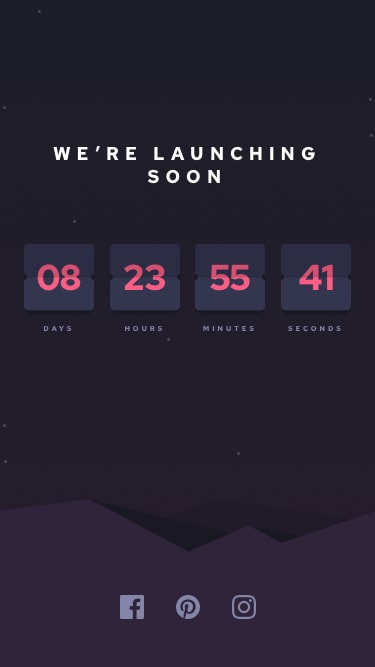

# Getting Started with Create React App

Este proyecto fue realizado con las siguientes herramientas:

Estilos (responsive):
- Styled-Components. 
- css. 
- Bootstrap. 

Logica y Libreria:
- Javascript. 
- React.

El contador tiene vencimiento el dia 27 de abril del 2022, por lo que si se requiere ver con otra fecha debe cambiarse en el archivo CountdownTimer.js linea 17.

## Available Scripts

para correrlo:

### `npm start`

Runs the app in the development mode.\
Open [http://localhost:3000](http://localhost:3000) to view it in your browser.

## Links de Repositorio:
https://github.com/julianest/Countdown-Timer.git

## Links de Despliegue:
https://julianest.github.io/Countdown-Timer/

